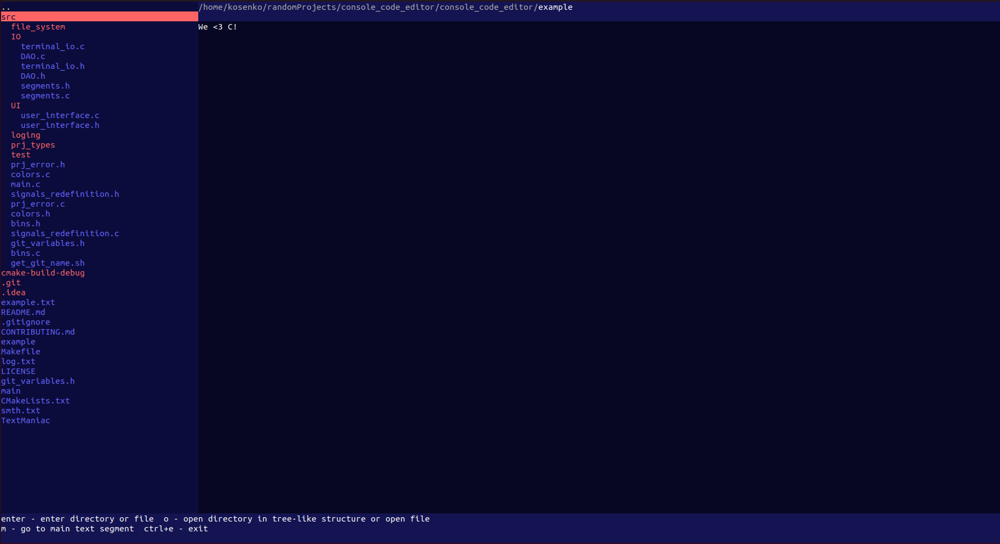

# TextManiac

THIS SOFTWARE IS ONLY BETA, SO, PLEASE DON'T SCOLD US MUCH

## What is it?

This project is the simple code editor

You also can use several libraries from it:

* log library                                                (log.h)
* Array of void pointers                                     (Array_type.h)
* String, which contains: string, string_fast, string_array (String_struct.h)
* Test functions                                             (test_funcs.h)
* Terminal escape sequences, terminal input (implementation allows subscribing callbacks to
  it)                                  (terminal_io.h)
* Colored terminal output (colors.h)

## How to compile

Works only on Linux!!!

```
make get_git_name
make compile
```

And you will have the executable file, named TextManiac

[//]: # (## Why this program?)

## Screenshots



## How you can help?

We will be glad to hear about and fix issues. You can implement any features from TODO file (if it exists).
Detailed contribution guideline: https://github.com/BrainFutureOrg/console_code_editor/blob/main/CONTRIBUTING.md

## Contributors

* Kosenko Alexander [github](https://github.com/KosenkoAlexander)
* Shkarupylo Maksym [github](https://github.com/ShkarupyloMaksym)